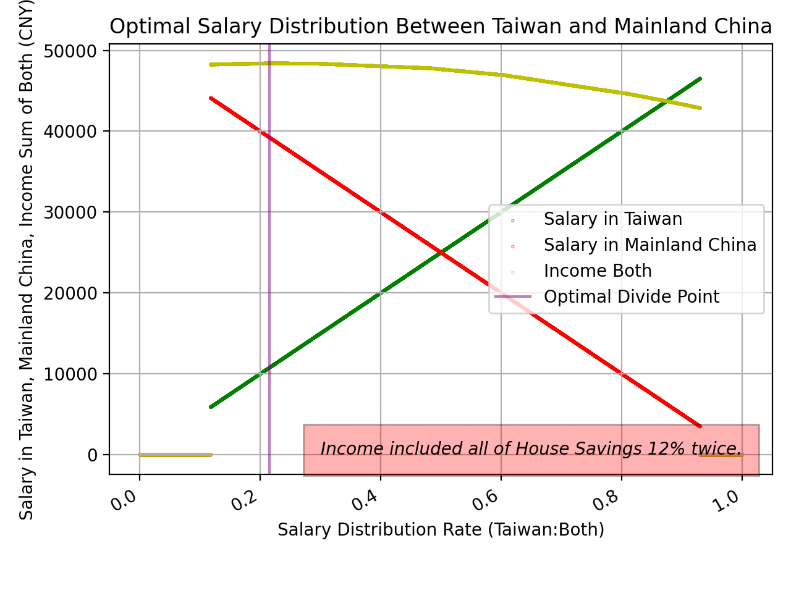
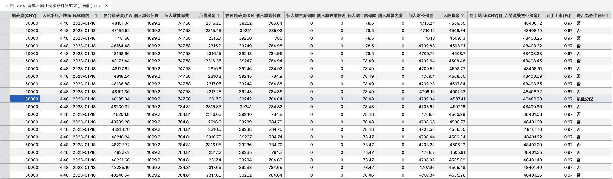

# OptimalSalaryDivideBetweenMainlandChinaAndTaiwan

幫助自己談薪時，算出一個對自己與雇主，都性價比最好的數字。

---

## 範例

設定一些台幹常見的約束條件：

- 繳交台灣的健保、勞保、所得稅  
```taiwanTax = TaiwanTax(salary_TWD)```

- 不繳交中國大陸的養老保險、失業保險
- 住房公積金拉滿到12%，雇主與個人同比例繳交  
```mainlandChinaTax = MainlandChinaTax(salary_CNY, house_savings_rate=0.12, is_retirement=False, is_unemployment_insurance=False)```

- 住房公積金雖然預設上是扣項，但我們想長期在大陸發展，算成到手部分，反正離職也能領出  
```real_income_CNY = mainlandChinaTax.salary_after_tax() + mainlandChinaTax.house_savings() * 2```

輸出：  
```bash
請輸入期望月薪資(CNY): 50000
2023-01-18 人民幣兌台幣匯率: 4.48

最佳分配: 
- 在台領薪資(TWD): 48195.840000000004
- 在陸領薪資(CNY): 39242
- 申報薪資比率(台:陸): 0.27414504867234085
- 到手總和(CNY)(計入勞資雙方公積金): 48408.779767857144
- 到手比率(%): 0.9681755953571429

1:1分配: 
- 在台領薪資(TWD): 112000.00000000001
- 在陸領薪資(CNY): 25000
- 申報薪資比率(台:陸): 1.0
- 到手總和(CNY)(計入勞資雙方公積金): 47657.96019345238
- 到手比率(%): 0.9531592038690476
```


